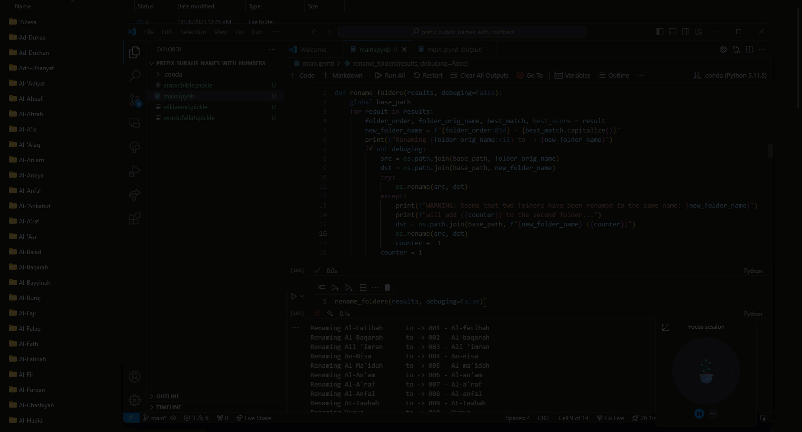

# Prefix Surahs' Names With Numbers

## Demo




## Description

* Given a folder containing a list of subfolders, each is named based on a Surah, this python script will rename the subfolders by prefixing the Surahs' names with their respective numbers.
* The mapping of Surahs' names to their numbers is based on the Quranic order, and is scraped from various websites.
* Since Surahs' names may be written in different ways, fuzzy matching is used to determine the best mapping between a folder's surah name and the scraped names. Then, these best matches are mapped to their respective numbers.
  * Example: "Ad-Duha" can get mapped to:
    * "Ad-Dukhan" (fuzzy match score: 70)
    * "AlDooha" (fuzzy match score: 70)
    * "Al-Duha" (fuzzy match score: 95)
  * Therefore, "Ad-Duha" will be mapped to "Al-Duha", and the new folder name will be "093 Ad-Duha"

## Usage

1. Or, using conda, but with environment.yml:
   ```bash
   conda env create -f environment.yaml
   ```

2. Or, install using pip:
   ```bash
   pip install -r requirements.txt
   ```

3. In `main.ipynb`, change the `base_path` variable to the path of the folder containing the subfolders to be renamed.

4. Run the `main.ipynb` file. 

5. The subfolders will be renamed in place.

## Contributing

Feel free to contribute to this project! Follow the steps [Here](https://www.youtube.com/watch?v=jRLGobWwA3Y). Specifically:

1. Fork the repository.

2. Clone the repository.
   ```bash
   git clone
   cd prefix_surahs_with_numbers
    ```

3. Create a new branch.

4. Make changes and test.

5. Commit changes.
   ```bash
   git commit -am "commit message"
   ```

6. Push changes.
   ```bash
   git push origin branch-name
   ```

7. Create a pull request.


:]